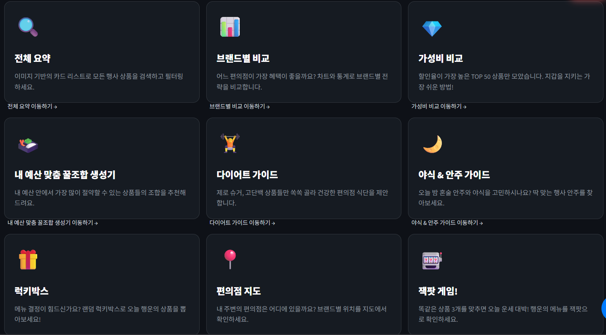
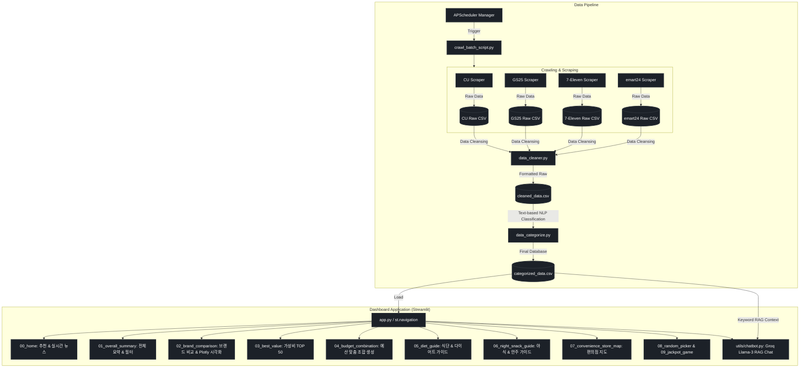

# 🏪 CVS Event Comparator (편의점 행사 상품 통합 대시보드)

> [!NOTE]
> **SK쉴더스 루키즈 5기**에서 Python · Streamlit · 바이브 코딩 교육을 진행한 뒤 이어진 **첫 번째 미니 프로젝트**입니다.

우리나라 편의점은 CU, GS25, 7-Eleven, emart24 등 브랜드가 다양하고, 브랜드마다 진행하는 행사도 제각각입니다.  
그런데 그 행사 상품을 **한곳에서 모아 비교**할 수 있는 곳이 없어, 이 서비스를 만들었습니다.

편의점 4사 웹 구조와 행사 페이지 로딩 방식이 다르기 때문에 **브랜드마다 맞는 크롤러**로 상품을 수집하고, 한 스키마로 **정제·카테고리화**한 뒤 Streamlit에서 **비교·추천**까지 이어 줍니다.

수집 → 정제 → 분류 파이프라인 위에 **브랜드 비교 시각화, 예산 맞춤 조합, 테마별 가이드(다이어트·야식), 편의점 지도, Groq 기반 AI 챗봇** 등을 붙여 둔 통합 분석 서비스입니다.

---

## 🛠 기술 스택

<p align="center">
  <picture>
    <source media="(prefers-color-scheme: dark)" srcset="assets/readme/badges/dark/python.png">
    <source media="(prefers-color-scheme: light)" srcset="assets/readme/badges/light/python.png">
    
  </picture>
  <picture>
    <source media="(prefers-color-scheme: dark)" srcset="assets/readme/badges/dark/streamlit.png">
    <source media="(prefers-color-scheme: light)" srcset="assets/readme/badges/light/streamlit.png">
    
  </picture>
  <picture>
    <source media="(prefers-color-scheme: dark)" srcset="assets/readme/badges/dark/pandas.png">
    <source media="(prefers-color-scheme: light)" srcset="assets/readme/badges/light/pandas.png">
    
  </picture>
  <picture>
    <source media="(prefers-color-scheme: dark)" srcset="assets/readme/badges/dark/plotly.png">
    <source media="(prefers-color-scheme: light)" srcset="assets/readme/badges/light/plotly.png">
    
  </picture>
  <picture>
    <source media="(prefers-color-scheme: dark)" srcset="assets/readme/badges/dark/selenium.png">
    <source media="(prefers-color-scheme: light)" srcset="assets/readme/badges/light/selenium.png">
    
  </picture>
  <picture>
    <source media="(prefers-color-scheme: dark)" srcset="assets/readme/badges/dark/beautifulsoup.png">
    <source media="(prefers-color-scheme: light)" srcset="assets/readme/badges/light/beautifulsoup.png">
    
  </picture>
  <picture>
    <source media="(prefers-color-scheme: dark)" srcset="assets/readme/badges/dark/groq.png">
    <source media="(prefers-color-scheme: light)" srcset="assets/readme/badges/light/groq.png">
    
  </picture>
</p>

<div align="center">

<table align="center">
  <thead>
    <tr>
      <th align="left">구분</th>
      <th align="left">기술</th>
      <th align="left">역할</th>
    </tr>
  </thead>
  <tbody>
    <tr>
      <td align="left"><strong>Dashboard UI</strong></td>
      <td align="left">Streamlit, Custom CSS</td>
      <td align="left">멀티 페이지 대시보드, 다크/글래스모피즘 테마</td>
    </tr>
    <tr>
      <td align="left"><strong>Visualization</strong></td>
      <td align="left">Plotly, Folium</td>
      <td align="left">브랜드 비교 차트, 편의점 지도·클러스터</td>
    </tr>
    <tr>
      <td align="left"><strong>Data Pipeline</strong></td>
      <td align="left">BeautifulSoup, Requests, Pandas</td>
      <td align="left">4사 상품 크롤링 → 정제 → 카테고리 분류</td>
    </tr>
    <tr>
      <td align="left"><strong>Event News</strong></td>
      <td align="left">Selenium</td>
      <td align="left">공식 행사 뉴스 동적 페이지 수집</td>
    </tr>
    <tr>
      <td align="left"><strong>Batch</strong></td>
      <td align="left">APScheduler, Loguru</td>
      <td align="left">매일 06:00(KST) 자동 수집·갱신</td>
    </tr>
    <tr>
      <td align="left"><strong>AI Chatbot</strong></td>
      <td align="left">Groq (Llama 3.3) + 로컬 RAG</td>
      <td align="left">키워드로 상품 CSV를 뽑아 컨텍스트로 주입</td>
    </tr>
  </tbody>
</table>

</div>

---

## 🖥️ 서비스 미리보기

<div align="center">
  
  <p>메인보드 — 핫딜 배너 · 시간대별 추천 · 뉴스 피드</p>
</div>

<div align="center">

<table align="center">
  <thead>
    <tr>
      <th align="left">메뉴</th>
      <th align="left">설명</th>
    </tr>
  </thead>
  <tbody>
    <tr>
      <td align="left">🏠 메인보드</td>
      <td align="left">핫딜 배너, 시간대별 추천, 뉴스 피드</td>
    </tr>
    <tr>
      <td align="left">🔍 전체 요약</td>
      <td align="left">브랜드·행사·카테고리 필터와 상품 검색</td>
    </tr>
    <tr>
      <td align="left">📊 브랜드 비교</td>
      <td align="left">4사 행사 전략·가격·카테고리 비교 시각화</td>
    </tr>
    <tr>
      <td align="left">💎 가성비 TOP 50</td>
      <td align="left">실질 구매가·할인 효과 기준 가성비 랭킹</td>
    </tr>
    <tr>
      <td align="left">🍱 내 예산 맞춤 꿀조합 생성기</td>
      <td align="left">예산에 맞춘 1+1 / 2+1 조합 추천</td>
    </tr>
    <tr>
      <td align="left">🏋️ 다이어트 &amp; 식단 가이드</td>
      <td align="left">칼로리·식사 테마별 추천 상품</td>
    </tr>
    <tr>
      <td align="left">🌙 야식 &amp; 안주 가이드</td>
      <td align="left">야식·안주 테마 추천 상품</td>
    </tr>
    <tr>
      <td align="left">🎁 럭키박스</td>
      <td align="left">조건에 맞는 랜덤 상품 뽑기</td>
    </tr>
    <tr>
      <td align="left">📍 편의점 지도</td>
      <td align="left">주변 편의점 위치 지도 (Folium)</td>
    </tr>
    <tr>
      <td align="left">🎰 잭팟 게임</td>
      <td align="left">슬롯 머신 스타일 이벤트 게임</td>
    </tr>
    <tr>
      <td align="left">🎉 행사 및 이벤트 소식</td>
      <td align="left">편의점 공식 행사·이벤트 뉴스</td>
    </tr>
  </tbody>
</table>

</div>

---

## 🌟 프로젝트 핵심 차별화 포인트 (Portfolio Highlights)

1. **자동화된 데이터 파이프라인 (Data Pipeline & Batch Scheduler)**
   - 브랜드별 웹 구조에 맞춘 Requests + BeautifulSoup 크롤러로 4사 행사 상품 수집.
   - Selenium으로 공식 행사 뉴스(동적 페이지) 수집.
   - `APScheduler`로 매일 06:00(KST) 배치 갱신·클렌징.
2. **AI RAG 기반 편의점 추천 챗봇 (Groq Llama-3 Chatbot)**
   - 사용자의 입력 키워드를 기반으로 상품 데이터베이스(CSV)를 필터링하여 컨텍스트(Context)로 전달하는 실시간 룰 기반 챗봇 서비스 설계.
   - 자연스러운 한국어로 상품 정보 및 페어링 팁을 알려주는 대화형 에이전트 구현.
3. **스마트 예산 조합 알고리즘 (Greedy & Dynamic Combination)**
   - 사용자가 입력한 예산에 맞추어 영양과 만족도를 고려한 최적의 1+1, 2+1 행사 상품 조합을 계산해 제안하는 기능 제공.
4. **위치 기반 편의점 지도 서비스 (Geospatial Visualization)**
   - `Folium`과 `streamlit-folium`을 연동하여 편의점 브랜드별 마커 클러스터링 지도 시각화.
5. **인터랙티브 UX & 다크모드/글래스모피즘 테마**
   - CSS 기반의 미려한 카드 UI 스타일링, 흐르는 배너 및 럭키박스, 잭팟 슬롯머신 등 사용자 참여를 유도하는 게이미피케이션 적용.

---

## 🏗️ 시스템 아키텍처 (System Architecture)



---

## 📂 프로젝트 구조 (Project Folder Structure)

```text
conv-dashboard/
┣━━ 📂 .devcontainer/               # 개발 환경 컨테이너화 설정 (DevContainer)
┃   ┗━━ 📄 devcontainer.json        # 클라우드/컨테이너 개발 환경 명세
┣━━ 📂 .streamlit/                  # Streamlit 설정 폴더
┃   ┗━━ 📄 config.toml              # 테마(Dark), 레이아웃 및 포트 설정
┣━━ 📂 assets/                      # 브랜드 로고 · README 에셋
┃   ┣━━ 📂 readme/                  # README용 스크린샷 · 뱃지
┃   ┃   ┣━━ 📂 badges/dark/         # 기술 스택 뱃지 (다크 테마)
┃   ┃   ┣━━ 📂 badges/light/        # 기술 스택 뱃지 (라이트 테마)
┃   ┃   ┗━━ 🖼️ main.png             # 서비스 미리보기
┃   ┣━━ 🖼️ logo_cu.png
┃   ┣━━ 🖼️ logo_gs25.png
┃   ┣━━ 🖼️ logo_7eleven.png
┃   ┗━━ 🖼️ logo_emart24.png
┣━━ 📂 batch/                       # 데이터 수집 자동화 및 스케줄러 (UI와 분리)
┃   ┣━━ 📂 script/
┃   ┃   ┗━━ 📄 crawl_batch_script.py # 통합 크롤링 및 정제 실행 자동화 스크립트
┃   ┣━━ 📄 batch_scheduler_manager.py # 백그라운드 APScheduler 스케줄러 관리자
┃   ┣━━ 📄 run_scheduler.py         # 스케줄러 상시 실행 (매일 06:00)
┃   ┣━━ 📄 run_once.py              # 배치 1회 즉시 실행
┃   ┗━━ 📄 __init__.py
┣━━ 📂 data/                        # 데이터 저장소 (CSV)
┃   ┣━━ 📄 CU_260224.csv            # 브랜드별 수집 원본 로우 데이터
┃   ┣━━ 📄 GS25_260224.csv
┃   ┣━━ 📄 7Eleven_260224.csv
┃   ┣━━ 📄 emart24_260224.csv
┃   ┣━━ 📄 cleaned_data.csv         # 중복 제거 및 누락치 처리 완료 데이터
┃   ┣━━ 📄 categorized_data.csv     # 최종 상품 분류 및 인덱싱이 끝난 메인 데이터
┃   ┗━━ 📄 filtered_convenience_stores.csv # 위치 기반 편의점 매장 데이터
┣━━ 📂 pages/                       # 대시보드 핵심 기능 웹 페이지 모듈
┃   ┣━━ 📄 00_home.py               # 실시간 추천 핫딜, 꿀팁봇, 뉴스 피드 메인보드
┃   ┣━━ 📄 01_overall_summary.py    # 이미지 카드 레이아웃 기반 통합 검색/필터 페이지
┃   ┣━━ 📄 02_brand_comparison.py   # 브랜드별 상품 구성, 행사 규모 시각화 비교
┃   ┣━━ 📄 03_best_value.py         # 실질 할인율/효율 기준 TOP 50 랭킹 정보
┃   ┣━━ 📄 04_budget_combination.py # 예산 조건 충족 최적 번들 조합 구성기
┃   ┣━━ 📄 05_diet_guide.py         # 닭가슴살, 제로 탄산 등 다이어터 특화 상품 정보
┃   ┣━━ 📄 06_night_snack_guide.py  # 혼술 안주, 새벽 야식 매칭 추천 서비스
┃   ┣━━ 📄 07_convenience_store_map.py # 전국 편의점 위치 시각화 (Folium 지리 공간 지도)
┃   ┣━━ 📄 08_random_picker.py      # 결정 장애 해결용 럭키박스 뽑기
┃   ┣━━ 📄 09_jackpot_game.py       # 재미 요소를 결합한 상품 매칭 슬롯머신
┃   ┗━━ 📄 10_event_news.py         # 편의점 업계 최신 마케팅 및 이벤트 동향 소식
┣━━ 📂 scraper/                     # 편의점 4사 전용 크롤링 라이브러리
┃   ┣━━ 📄 cu_scraper.py            # CU (Requests + BeautifulSoup)
┃   ┣━━ 📄 gs25_scraper.py          # GS25 (Requests + BeautifulSoup)
┃   ┣━━ 📄 seven_eleven_scraper.py  # 7-Eleven (Requests + BeautifulSoup)
┃   ┣━━ 📄 emart24_scraper.py       # emart24 (Requests + BeautifulSoup)
┃   ┗━━ 📄 event_news_scraper.py    # 공식 행사 뉴스 (Selenium)
┃   ┣━━ 📄 event_news_scraper.py    # 브랜드별 보도자료/뉴스 연동용 스크래퍼
┃   ┗━━ 📄 __init__.py
┣━━ 📂 test/                        # 스케줄러 기능 검증 및 개별 스크립트 테스트 폴더
┣━━ 📂 utils/                       # 공통 유틸리티 및 AI/시각화 모듈
┃   ┣━━ 📄 data_cleaner.py          # 수집 데이터 텍스트 정제 및 중복 제어 (공유 코어)
┃   ┣━━ 📄 data_cleaner_batch.py    # YYMM 파일 선택 후 공유 코어로 정제
┃   ┣━━ 📄 data_categorize.py       # 상품명 키워드 패턴 매칭 기반 카테고리 분류 엔진
┃   ┣━━ 📄 data_loader.py           # 카탈로그 CSV 캐시 로더
┃   ┣━━ 📄 theme_guide.py           # 다이어트/야식 테마 가이드 공통 UI
┃   ┣━━ 📄 chatbot.py               # Groq API 활용 LLM Chatbot 로직
┃   ┣━━ 📄 cart.py                  # 장바구니/장바구니 찜하기 데이터 유지 관리
┃   ┣━━ 📄 news_scraper.py          # 네이버/다음 뉴스 포털 크롤링 래퍼
┃   ┗━━ 📄 __init__.py
┣━━ 📄 app.py                       # 메인 컨트롤러 및 사이드바 내비게이션 진입점
┣━━ 📄 style.css                    # 다크 모드 맞춤 커스텀 CSS (Glassmorphism 적용)
┣━━ 📄 requirements.txt             # 개발 패키지 명세서
┗━━ 📄 .gitignore                   # Git 제외 파일 관리 가이드
```

---

## ⚙️ 설치 및 로컬 실행 방법

### 1. 레포지토리 클론 및 폴더 이동

```bash
git clone https://github.com/Hyeonseok93/SK-Rookies5-MINI1_CVS-EVENT-COMPARATOR.git
cd SK-Rookies5-MINI1_CVS-EVENT-COMPARATOR
```

### 2. 가상환경 구축 및 패키지 설치

```bash
python -m venv venv
```

가상환경 활성화:

```bat
:: Windows CMD
venv\Scripts\activate.bat

:: Windows PowerShell
venv\Scripts\Activate.ps1

:: Mac/Linux
source venv/bin/activate
```

```bash
pip install -r requirements.txt
```

### 3. 환경 변수 설정

프로젝트 루트 디렉토리에 `.env` 파일을 생성하고 Groq API 키를 설정합니다. (챗봇 기능을 사용하지 않으려면 생략 가능)

```env
GROQ_API_KEY=your_groq_api_key_here
```

### 4. 대시보드 애플리케이션 실행

Windows CMD 예시:

```bat
venv\Scripts\activate.bat
streamlit run app.py
```

Mac/Linux / 이미 가상환경이 켜진 경우:

```bash
streamlit run app.py
```

> 스케줄러는 Streamlit과 **분리**되어 있습니다. UI만 띄울 때는 위 명령만 사용하세요.

### 5. 일간 배치 스케줄러 (선택)

대시보드와 **별도 프로세스**로 스케줄러를 띄웁니다 (매일 06:00 KST).

```bash
python -m batch.run_scheduler
```

즉시 한 번만 돌리려면:

```bash
python -m batch.run_once
# 점검만: python -m batch.run_once --dry-run
# 특정 달: python -m batch.run_once --year 2026 --month 7
```

### 6. 수동 데이터 크롤링 및 업데이트 (선택 사항)

데이터를 즉시 업데이트하고 싶다면 아래 명령어를 순서대로 실행합니다:

```bash
# 편의점 4사 데이터 스크래핑 실행
python scraper/cu_scraper.py
python scraper/gs25_scraper.py
python scraper/seven_eleven_scraper.py
python scraper/emart24_scraper.py

# 데이터 정제 및 카테고리 자동 분류 적용
python utils/data_cleaner.py
python utils/data_categorize.py
```

---

## 🎨 주요 화면 가이드 (Features Walkthrough)

| 🏠 메인보드 (`00_home.py`)                                                                | 🔍 전체 요약 (`01_overall_summary.py`)                                           |
| ----------------------------------------------------------------------------------------- | -------------------------------------------------------------------------------- |
| 맞춤형 핫딜 배너 스크롤러, 시간대별 지능형 메뉴 추천, 편의점 업계 최신 보도자료 피드 탑재 | 정교한 다중 선택 필터(브랜드, 행사 유형, 카테고리) 및 텍스트 통합 검색 엔진 제공 |

| 📊 브랜드 비교 (`02_brand_comparison.py`)                                    | 🍱 예산 맞춤 꿀조합 (`04_budget_combination.py`)                      |
| ---------------------------------------------------------------------------- | --------------------------------------------------------------------- |
| Plotly를 이용한 브랜드별 행사 상품 점유율 분석 및 평균 단가 비교 그래프 제공 | 예산 맞춤 알고리즘을 사용해 최대 효율을 내는 최적 번들 상품 조합 추천 |

| 📍 편의점 지도 (`07_convenience_store_map.py`)                                | 💬 AI 꿀팁봇 (`utils/chatbot.py`)                                       |
| ----------------------------------------------------------------------------- | ----------------------------------------------------------------------- |
| 마커 클러스터 기능을 활용한 사용자 위치 기반 주변 4대 편의점 위치 매핑 시각화 | Groq Llama-3 기반으로 실시간 맥락 파악 및 상품 매칭, 페어링 가이드 제공 |

---

---

## 🚀 편의점 최신화 행사 정보 수집 배치

편의점 4사(7-Eleven, CU, GS25, Emart24)의 행사 정보를 자동으로 수집하고 분류하는 배치

### 📅 실행 스케줄
- **실행 일시**: 매일 06:00 (KST 기준)
- **주요 목적**: 편의점 행사 정보를 매일 수집·정제하여 대시보드 데이터를 최신화

### 🛠 주요 기능
1. **데이터 크롤링**: 각 편의점 사이트의 최신 행사 데이터를 수집합니다.
2. **데이터 정제**: 수집된 원본 데이터(편의점 행사정보 상품 데이터)를 `data_cleaner_batch`를 통해 통합 및 중복 제거합니다.
3. **자동 분류**: 수집된 상품명을 분석하여 식사류, 간식류, 음료 등의 카테고리로 자동 매핑합니다.

### 📂 디렉토리 구조
- `batch/`: 배치 스크립트 메인 로직 및 스케줄러 관리 (**Streamlit과 별도 프로세스**)
  - `script/`: 배치 스크립트 위치
  - `batch_scheduler_manager.py`: 배치 스케줄러 설정
  - `run_scheduler.py`: `python -m batch.run_scheduler` 진입점
- `test/`: 배치 스크립트 테스트 케이스 및 테스트코드

### 🧪 테스트 및 참고 사항
- 프로젝트 루트에서 test 디렉토리로 이동 아래의 명령어로 실행
```bash
cd test

python batch_script_test.py
```

스케줄러 상시 기동 예:
```bash
python -m batch.run_scheduler
```
---

&nbsp;
## 💻 개발자 (Developers)

| <a href="https://github.com/Engineer-kim" target="_blank"></a> | <a href="https://github.com/Hyeonseok93" target="_blank"></a> | <a href="https://github.com/hongjiho5148" target="_blank"></a> | <a href="https://github.com/owhat02" target="_blank"></a> | <a href="https://github.com/seoyeon020" target="_blank"></a> | <a href="https://github.com/siyeon04" target="_blank"></a> |
|:-------------:|:------:|:------:|:------:|:------:|:------:|
| [김한진(팀장)]([https://github.com/Engineer-kim) | [김현석](https://github.com/Hyeonseok93) | [홍지호](https://github.com/hongjiho5148) | [이새연](https://github.com/owhat02) | [임서연](https://github.com/seoyeon020) | [이시연](https://github.com/siyeon04) |

