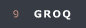
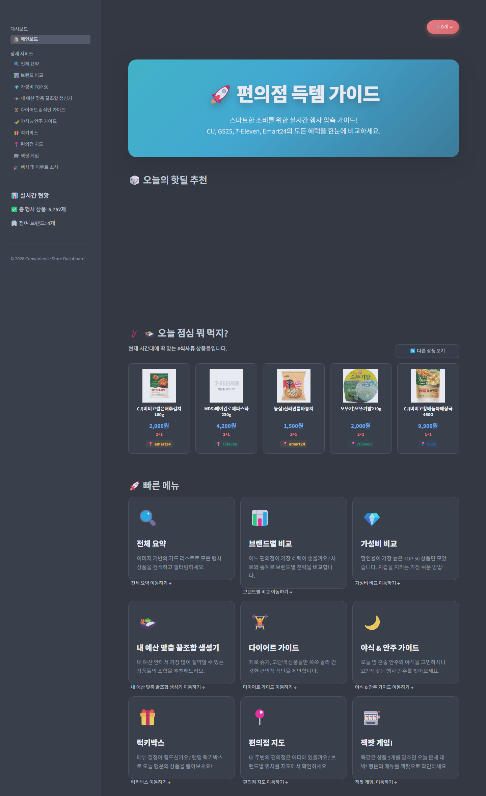

# 🏪 CVS Event Comparator (편의점 행사 상품 통합 대시보드)

## 💻 Developers

| <a href="https://github.com/Engineer-kim" target="_blank"></a> | <a href="https://github.com/Hyeonseok93" target="_blank"></a> | <a href="https://github.com/hongjiho5148" target="_blank"></a> | <a href="https://github.com/owhat02" target="_blank"></a> | <a href="https://github.com/seoyeon020" target="_blank"></a> | <a href="https://github.com/siyeon04" target="_blank"></a> |
|:-------------:|:------:|:------:|:------:|:------:|:------:|
| [김한진(팀장)](https://github.com/Engineer-kim) | [김현석](https://github.com/Hyeonseok93) | [홍지호](https://github.com/hongjiho5148) | [이새연](https://github.com/owhat02) | [임서연](https://github.com/seoyeon020) | [이시연](https://github.com/siyeon04) |

---

> [!NOTE]
> **SK쉴더스 루키즈 5기**에서 Python · Streamlit · 바이브 코딩 교육을 진행한 뒤 이어진 **첫 번째 미니 프로젝트**입니다.

## 🚀 Overview

우리나라 편의점은 CU, GS25, 7-Eleven, emart24 등 브랜드가 다양하고, 브랜드마다 진행하는 행사도 제각각입니다.  
그런데 그 행사 상품을 **한곳에서 모아 비교**할 수 있는 곳이 없어, 이 서비스를 만들었습니다.

편의점 4사 웹 구조와 행사 페이지 로딩 방식이 다르기 때문에 **브랜드마다 맞는 크롤러**로 상품을 수집하고, 한 스키마로 **정제·카테고리화**한 뒤 Streamlit에서 **비교·추천**까지 이어 줍니다.

수집 → 정제 → 분류 파이프라인 위에 **브랜드 비교 시각화, 예산 맞춤 조합, 테마별 가이드(다이어트·야식), 편의점 지도, Groq 기반 AI 챗봇** 등을 붙여 둔 통합 분석 서비스입니다.

---

## 🛠 Built With

<p>
<picture>
  <source media="(prefers-color-scheme: dark)" srcset="assets/readme/badges/dark/python.png">
  <source media="(prefers-color-scheme: light)" srcset="assets/readme/badges/light/python.png">
  
</picture>
<picture>
  <source media="(prefers-color-scheme: dark)" srcset="assets/readme/badges/dark/streamlit.png">
  <source media="(prefers-color-scheme: light)" srcset="assets/readme/badges/light/streamlit.png">
  
</picture>
<picture>
  <source media="(prefers-color-scheme: dark)" srcset="assets/readme/badges/dark/pandas.png">
  <source media="(prefers-color-scheme: light)" srcset="assets/readme/badges/light/pandas.png">
  
</picture>
<picture>
  <source media="(prefers-color-scheme: dark)" srcset="assets/readme/badges/dark/plotly.png">
  <source media="(prefers-color-scheme: light)" srcset="assets/readme/badges/light/plotly.png">
  
</picture>
<picture>
  <source media="(prefers-color-scheme: dark)" srcset="assets/readme/badges/dark/selenium.png">
  <source media="(prefers-color-scheme: light)" srcset="assets/readme/badges/light/selenium.png">
  
</picture>
<picture>
  <source media="(prefers-color-scheme: dark)" srcset="assets/readme/badges/dark/beautifulsoup.png">
  <source media="(prefers-color-scheme: light)" srcset="assets/readme/badges/light/beautifulsoup.png">
  
</picture>
<picture>
  <source media="(prefers-color-scheme: dark)" srcset="assets/readme/badges/dark/groq.png">
  <source media="(prefers-color-scheme: light)" srcset="assets/readme/badges/light/groq.png">
  
</picture>
</p>

<details>
<summary><strong>기술 스택 상세 보기</strong></summary>

<br>

<div align="center">

<table align="center">
  <thead>
    <tr>
      <th align="left">구분</th>
      <th align="left">기술</th>
      <th align="left">역할</th>
    </tr>
  </thead>
  <tbody>
    <tr>
      <td align="left"><strong>Dashboard UI</strong></td>
      <td align="left">Streamlit, Custom CSS</td>
      <td align="left">멀티 페이지 대시보드, 다크/글래스모피즘 테마</td>
    </tr>
    <tr>
      <td align="left"><strong>Visualization</strong></td>
      <td align="left">Plotly, Folium</td>
      <td align="left">브랜드 비교 차트, 편의점 지도·클러스터</td>
    </tr>
    <tr>
      <td align="left"><strong>Data Pipeline</strong></td>
      <td align="left">BeautifulSoup, Requests, Pandas</td>
      <td align="left">4사 상품 크롤링 → 정제 → 카테고리 분류</td>
    </tr>
    <tr>
      <td align="left"><strong>Event News</strong></td>
      <td align="left">Selenium</td>
      <td align="left">공식 행사 뉴스 동적 페이지 수집</td>
    </tr>
    <tr>
      <td align="left"><strong>Batch</strong></td>
      <td align="left">APScheduler, Loguru</td>
      <td align="left">매일 06:00(KST) 자동 수집·갱신</td>
    </tr>
    <tr>
      <td align="left"><strong>AI Chatbot</strong></td>
      <td align="left">Groq (Llama 3.3) + 로컬 RAG</td>
      <td align="left">키워드로 상품 CSV를 뽑아 컨텍스트로 주입</td>
    </tr>
  </tbody>
</table>

</div>

</details>

---

## 🖥️ Preview · [자세히 보기](https://bulldog93.tistory.com/45)

<div align="center">
  
  <p>메인 페이지</p>
</div>

<div align="center">

<table align="center">
  <thead>
    <tr>
      <th align="left">메뉴</th>
      <th align="left">설명</th>
    </tr>
  </thead>
  <tbody>
    <tr>
      <td align="left">🏠 메인보드</td>
      <td align="left">핫딜 배너, 시간대별 추천, 뉴스 피드</td>
    </tr>
    <tr>
      <td align="left">🔍 전체 요약</td>
      <td align="left">브랜드·행사·카테고리 필터와 상품 검색</td>
    </tr>
    <tr>
      <td align="left">📊 브랜드 비교</td>
      <td align="left">4사 행사 전략·가격·카테고리 비교 시각화</td>
    </tr>
    <tr>
      <td align="left">💎 가성비 TOP 50</td>
      <td align="left">실질 구매가·할인 효과 기준 가성비 랭킹</td>
    </tr>
    <tr>
      <td align="left">🍱 내 예산 맞춤 꿀조합 생성기</td>
      <td align="left">예산에 맞춘 1+1 / 2+1 조합 추천</td>
    </tr>
    <tr>
      <td align="left">🏋️ 다이어트 &amp; 식단 가이드</td>
      <td align="left">칼로리·식사 테마별 추천 상품</td>
    </tr>
    <tr>
      <td align="left">🌙 야식 &amp; 안주 가이드</td>
      <td align="left">야식·안주 테마 추천 상품</td>
    </tr>
    <tr>
      <td align="left">🎁 럭키박스</td>
      <td align="left">조건에 맞는 랜덤 상품 뽑기</td>
    </tr>
    <tr>
      <td align="left">📍 편의점 지도</td>
      <td align="left">주변 편의점 위치 지도 (Folium)</td>
    </tr>
    <tr>
      <td align="left">🎰 잭팟 게임</td>
      <td align="left">슬롯 머신 스타일 이벤트 게임</td>
    </tr>
    <tr>
      <td align="left">🎉 행사 및 이벤트 소식</td>
      <td align="left">편의점 공식 행사·이벤트 뉴스</td>
    </tr>
  </tbody>
</table>

</div>

---

## 🌟 Key Implementation

1. **브랜드별 맞춤 크롤러 (CU / GS25 / 7-Eleven / emart24)**  
   사이트마다 HTML·API·인증 방식이 달라서 스크래퍼를 4개로 분리했습니다. 수집 결과는 공통 스키마(`brand`, `name`, `price`, `event`, `img_url`)로 CSV에 맞춥니다.
   - **CU**: 행사 목록을 **Ajax HTML 조각**으로 **POST** 받아옵니다. 응답이 페이지 단위로 잘려 있어 **page index**를 1부터 올리며 순회하고, 각 조각에서 BeautifulSoup으로 상품명·가격·행사 뱃지·이미지 URL을 파싱해 누적합니다. 상품이 없는 빈 페이지가 나오면 중단하며, 요청 간격과 페이지 상한으로 과도한 호출을 막습니다. 저장 전 `name`/`price`/`event` 기준 중복도 정리합니다.
   - **GS25**: 화면 HTML을 긁기보다 **JSON 검색 API**로 목록을 받습니다. 먼저 행사 상품 페이지 HTML에서 **CSRF 토큰**을 추출하고, 같은 세션으로 토큰을 붙여 **pageNum / pageSize** 페이지네이션 호출을 반복합니다. 응답의 행사 코드(`ONE_TO_ONE`, `TWO_TO_ONE`, `GIFT` 등)를 1+1·2+1·덤증정 같은 표시용 라벨로 매핑한 뒤 공통 스키마로 적재합니다.
   - **7-Eleven**: 행사 종류가 **탭 파라미터**(1+1 / 2+1)로 갈라져 있습니다. 탭마다 Ajax **POST**를 보내고, **page size를 크게** 잡아 해당 행사 목록을 한 번에 받은 뒤 HTML에서 상품 카드·행사 태그를 파싱합니다. 탭 라벨이 비어 있으면 요청 시점의 행사 유형을 fallback으로 씁니다.
   - **emart24**: 행사 종류(1+1 / 2+1 / 3+1)를 **카테고리 파라미터**로 고른 뒤, 카테고리마다 **page 기반 GET 페이지네이션**으로 목록 HTML을 받습니다. 페이지의 상품 카드에서 이름·가격·행사·이미지를 파싱하고, 요청 사이에는 짧은 **랜덤 딜레이**를 둡니다. 빈 페이지가 나오면 그 카테고리 수집을 끝내고 다음 행사 유형으로 넘어갑니다.

2. **자동 데이터 파이프라인 (Batch)**  
   브랜드별로 모은 원본을 하나로 합치고, 정제·카테고리 분류까지 이은 뒤 대시보드가 읽는 상품 카탈로그로 갱신합니다. Streamlit UI와는 **별도 프로세스**로 돌립니다.
   - **스케줄**: 매일 **06:00 KST** 자동 실행 (`python -m batch.run_scheduler`). 점검·수동 반영용 즉시 1회는 `python -m batch.run_once` (`--dry-run`으로 크롤 없이 점검 가능).
   - **흐름**: **4사 크롤 → 원본 병합·정제 → 카테고리 분류 → 공식 행사 뉴스 수집(Selenium)**. 뉴스는 4사 이벤트/소식 게시판을 열고, 이 단계만 실패해도 상품 카탈로그 갱신은 유지합니다.
   - **안전장치**: 브랜드 raw CSV가 하나라도 비거나 크롤이 실패하면 정제·분류를 건너뛰어, 깨진 데이터로 기존 카탈로그가 덮이지 않게 했습니다. 실행 로그는 `batch/batch_script_log/`에 남깁니다.

3. **AI 챗봇 · 간이 RAG (Groq Llama 3.3)**  
   플로팅 챗봇이 분류된 상품 카탈로그를 읽고, 사용자 문장에서 뽑은 키워드로 상품명·카테고리를 **리터럴 매칭**해 관련 행만 골라 컨텍스트로 넣습니다.
   - 매칭된 상위 최대 **20개**를 시스템 프롬프트에 붙인 뒤, Groq **Llama 3.3 70B**에 **스트리밍** 요청합니다.
   - 매칭이 없으면 카탈로그에서 표본을 **샘플링**해 넣습니다. 데이터에 없는 가격·행사는 지어내지 않도록 프롬프트로 제한했습니다.

---

## 📂 Project Structure

```text
SK-Rookies5-MINI1_CVS-EVENT-COMPARATOR/
┣━━ 📂 assets/                        # 브랜드 로고 · README용 에셋
┃   ┗━━ 📂 readme/
┃       ┣━━ 📂 badges/dark|light/     # README 기술 스택 뱃지
┃       ┗━━ 🖼️ preview-home.png       # README Preview용 스크린샷
┣━━ 📂 pages/                         # Streamlit 멀티 페이지
┣━━ 📂 scraper/                       # 4사 상품 크롤러 + 행사 뉴스(Selenium)
┃   ┗━━ 📄 base.py                    # 공통 저장 · 스키마 헬퍼
┣━━ 📂 batch/                         # 일간 배치 (UI와 분리)
┃   ┣━━ 📂 script/                    # 크롤 → 정제 → 분류 → 뉴스
┃   ┣━━ 📄 run_scheduler.py           # 매일 06:00 KST 상시 기동
┃   ┗━━ 📄 run_once.py                # 1회 즉시 실행 / dry-run
┣━━ 📂 utils/                         # 정제·분류·로더·챗봇·공통 UI
┣━━ 📂 data/                          # raw / cleaned / categorized CSV
┣━━ 📂 test/                          # 배치 · 스케줄러 수동 테스트
┣━━ 📄 app.py                         # Streamlit 진입점 · 내비게이션
┣━━ 📄 style.css                      # 전역 UI 스타일
┣━━ 📄 requirements.txt
┗━━ 📄 .env.example                   # GROQ_API_KEY 예시
```

---

## ⚙️ Getting Started

### 1. 레포지토리 클론

```bash
git clone https://github.com/Hyeonseok93/SK-Rookies5-MINI1_CVS-EVENT-COMPARATOR.git
cd SK-Rookies5-MINI1_CVS-EVENT-COMPARATOR
```

### 2. 가상환경 및 패키지 설치

```bash
python -m venv venv
```

```bat
:: Windows CMD
venv\Scripts\activate.bat

:: Windows PowerShell
venv\Scripts\Activate.ps1
```

```bash
# macOS / Linux
source venv/bin/activate

pip install -r requirements.txt
```

### 3. 환경 변수 (선택)

챗봇을 쓸 때만 루트에 `.env`를 둡니다. (없으면 UI만 동작)

```env
GROQ_API_KEY=your_groq_api_key_here
```

### 4. 대시보드 실행

```bash
streamlit run app.py
```

배치 스케줄러는 Streamlit과 **별도 프로세스**입니다. UI만 보면 위 명령이면 충분합니다.

### 5. 배치 (선택)

매일 **06:00 KST**로 카탈로그를 갱신하려면:

```bash
python -m batch.run_scheduler
```

지금 한 번만 돌리려면:

```bash
python -m batch.run_once
# python -m batch.run_once --dry-run
```

